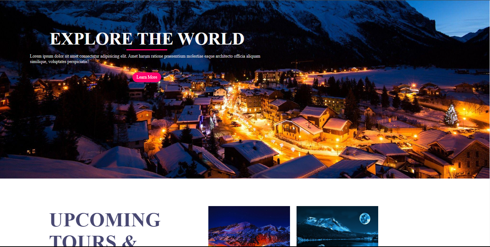

# Travel Agency Website

Welcome to the repository for our travel agency website! This website is built using HTML and CSS.

## Overview

This project is aimed at creating a modern and user-friendly website for our travel agency. The website showcases various destinations, travel packages, and services offered by our agency. 

## Features

- Responsive design: The website is optimized for different devices, ensuring a seamless experience for users whether they are accessing it from a desktop, tablet, or mobile phone.
- Beautiful UI: We have designed the website with visually appealing elements and intuitive navigation to enhance the user experience.
- Destination pages: Each destination has its own dedicated page with detailed information, including attractions, accommodations, and travel tips.
- Booking system: Users can easily book travel packages and accommodations directly through the website.

## Screenshots

## Technologies Used

- HTML
- CSS

## Getting Started

To get a local copy up and running, follow these simple steps:

1. Clone the repository: `git clone https://github.com/your-username/travel-agency-website.git`
2. Open the project directory in your preferred code editor.
3. Open `index.html` in your web browser to view the homepage.

## Contributing

Contributions are welcome! If you'd like to contribute to this project, please fork the repository and create a pull request.

## License

This project is licensed under the MIT License - see the [LICENSE](LICENSE) file for details.
